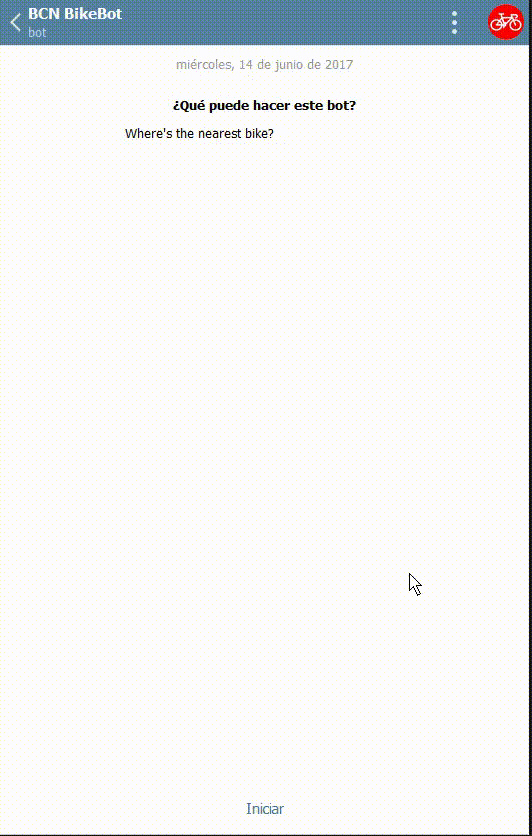

# BCN-BikeBot
Telegram chatbot for knowing the number of available bikes from the Barcelona Bicing service on each station in real time.

# Description
This Telegram chatbot makes an api request to the Barcelona public bicing service in order to know the number of bikes available on each station from the city, as much as the coordenates of each station and the status.

When the user starts the bot, he/she can request the status/number of bikes of one particular street (/street), one particular station (/station) or ask the bot to find the nearest station with more than 5 bikes available at the moment and a status of open (/nearstations).

Demostration of usage:

# How to use:

At today (14/06/2015) this bot is not running online because of the costs from hosting the python script. However, you can download the code from "BCNBikeBot.py" and run it locally on your computer. 

- step 1: Download the requirements.txt and open a command prompt. Run: pip install -r requirements.txt
- step 2: Go to the @botfather on Telegram and start a new bot. Copy the API token to your clipboard.
- step 3: Download the file "BCNBikeBot.py" and edit the line nº8: bot = telebot.TeleBot("PUT-YOUR-API-KEY-HERE"). Save it and close it.
- step 4: go with the command prompt to the same folder and run: python BCNBikeBot.py

And then you can go to the @BCNBikeBot and start playing!
